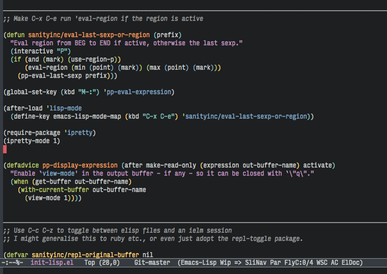

[](https://melpa.org/#/page-break-lines)
[](https://stable.melpa.org/#/page-break-lines)
[](https://github.com/purcell/page-break-lines/actions)
<a href="https://www.patreon.com/sanityinc"></a>

page-break-lines.el
===================

This Emacs library provides a global mode which displays ugly form feed
characters as tidy horizontal rules.

Screenshot
==========



Installation
=============

If you choose not to use one of the convenient
packages in [MELPA](https://melpa.org), you'll need to
add the directory containing `page-break-lines.el` to your `load-path`, and
then `(require 'page-break-lines)`.

Usage
=====

Enable `page-break-lines-mode` in an individual buffer like this:

```elisp
(page-break-lines-mode)
```

Alternatively, customize `page-break-lines-modes` and enable the mode globally with
`global-page-break-lines-mode`.

Note that Emacs already supports [“Pages”](https://www.gnu.org/software/emacs/manual/html_node/emacs/Pages.html)
and jumping around between page breaks with `C-x [` (`backward-page`)
and `C-x ]` (`forward-page`).

Issues and limitations
======================

If `page-break-lines-char` is displayed at a different width to
regular characters, the rule may be either too short or too long:
rules may then wrap if `truncate-lines` is nil. On some systems,
Emacs may erroneously choose a different font for the page break
symbol, which choice can be overridden using code such as:

```elisp
(set-fontset-font "fontset-default"
                  (cons page-break-lines-char page-break-lines-char)
                  (face-attribute 'default :family))
```

Use `describe-char` on a page break char to determine whether this
is the case.

Also see Vasilij Schneidermann's
[form-feed package](https://github.com/wasamasa/form-feed), which
works using font-lock instead of glyph composition, and therefore has
different display trade-offs.


<hr>

[💝 Support this project and my other Open Source work](https://www.patreon.com/sanityinc)

[💼 LinkedIn profile](https://uk.linkedin.com/in/stevepurcell)

[✍ sanityinc.com](http://www.sanityinc.com/)

[🐦 @sanityinc](https://twitter.com/sanityinc)
